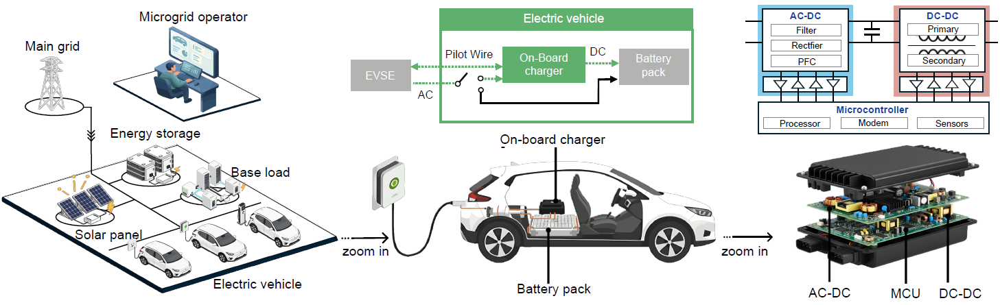
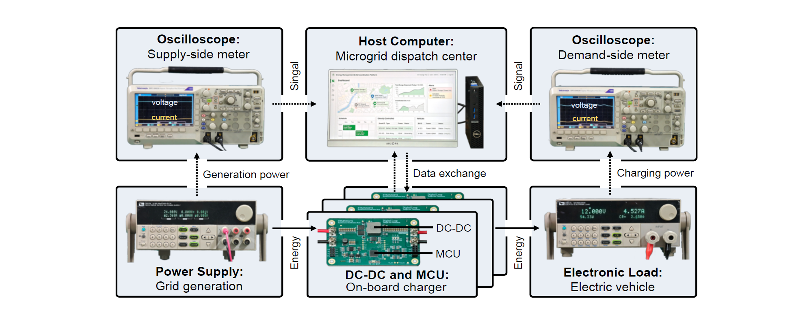
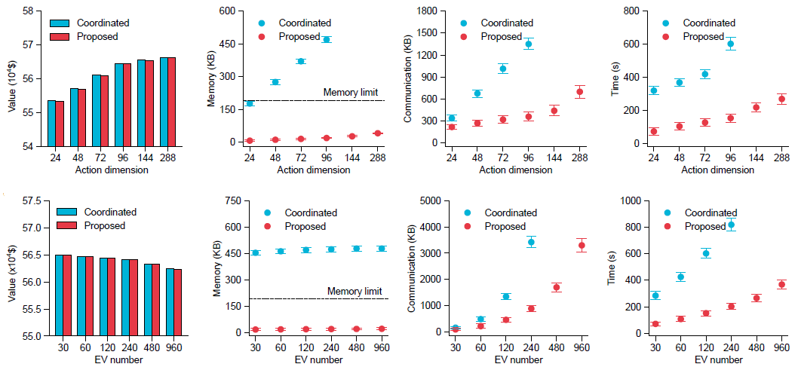
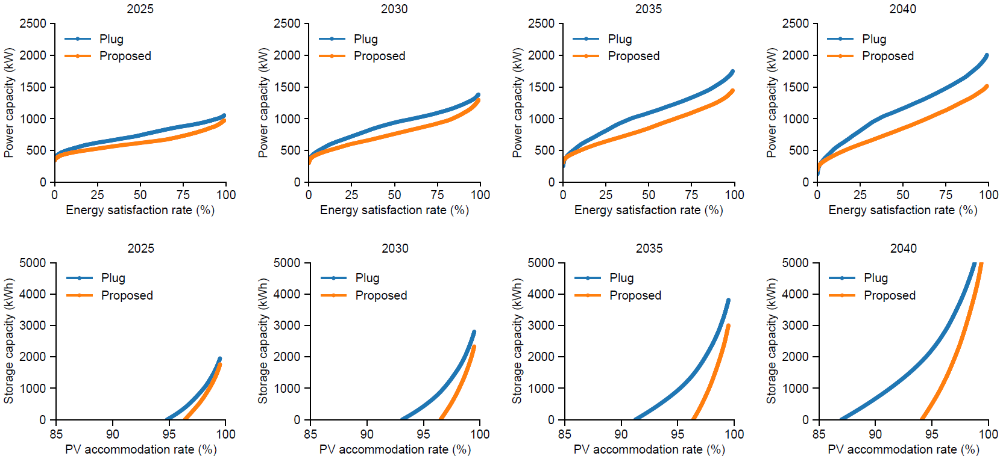
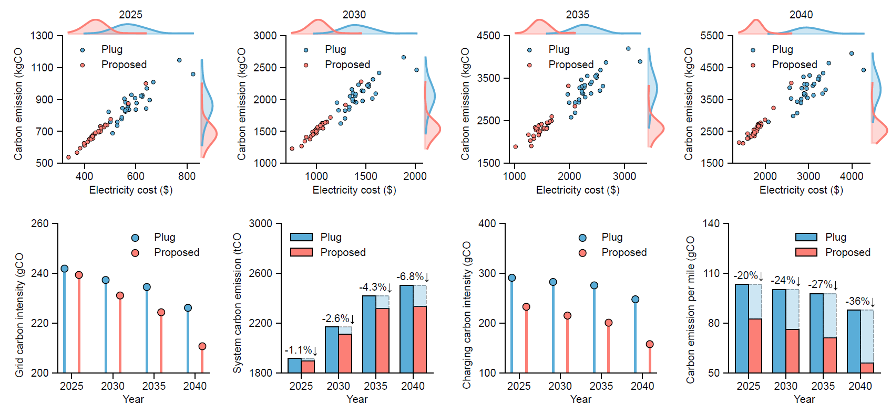
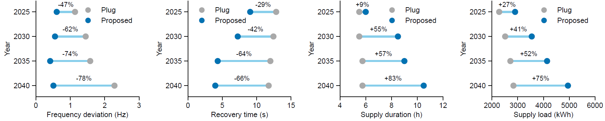

# On-Charger-Electric-Vehicle-Coordination

This is the codebase for our paper "Unlocking electric vehicle flexibility in microgrids via lightweight on-charger coordination".

## Overview

The rapid electrification of transport poses significant stability and economic challenges to microgrids due to uncoordinated charging loads. Here, we propose a lightweight distributed coordination framework that enables on-charger microcontrollers to optimize charging schedules autonomously in response to real-time microgrid conditions. Validated on a high-fidelity hardware-in-the-loop platform simulating complex microgrid cyber-physical dynamics, the results demonstrate that our framework reduces memory consumption by 96.1% and communication overhead by 74.3% compared to traditional distributed schemes.

## Experimental platform

You can build the **hardware-in-the-loop platform** with the power supply, electronic load, oscilloscope, microcontrollers (on-board chargers), and host computer (microgrid platform). `Hardware-in-the-loop_Platform` is loaded with the code deployed on them.
> **Note:** The microcontrollers are coded in  **C language** and the host computer is coded in **Python**.
> 

To use the provided code, you are supposed to:
- Load the dataset `Simulation_Platform/dataset/ev_load/.csv` into microcontrollers.
- Compile `Hardware-in-the-loop_Platform/On-board_Charger/User_code/.uvprojx` and download the code to the flash memory of microcontrollers.
- Run `Hardware-in-the-loop_Platform/Microgrid_Platform/run.py` on host computer.
> **Note:** Please ensure the microcontroller is configured with at least 128 KB of SRAM and 1 MB of FLASH.
> 
> **Note:** Please ensure the communication network is connected and stable before use.

## Simulation platform

You can also build the **simulation platform** with the tower server for large-scale numerical simulation. `Simulation_Platform` is loaded with the code deployed on it.

To use the provided code, please run `Simulation_Platform/test.ipynb` to obtain the results:

`operator.solution_centralized()`: Optimal

`operator.solution_distributed()`: Coordinated

`operator.solution_tiny()`: Proposed

`operator.solution_global()`: Global

`operator.solution_local()`: Local

`operator.solution_plug()`: Plug

## Experimental results

Enable on-board chargers to optimize charging schedules autonomously with lightweight distributed coordination.

 - Performance comparison

 - Impact on gird infrasturcture

 - Impacts on carbon emission 

 - Impacts on grid security

## Requirements

Experimental platform:
- Microcontroller: μVision 5.3+ and STM32G474 MCU
- Host computer: Python 3.8+ and Inter i7 12700 4.9GHz CPU

Simulation platform:
- Python 3.8+
- PyTorch 1.4.1+
- NVIDIA GeForce RTX 3080 Ti 12GB GPU
 